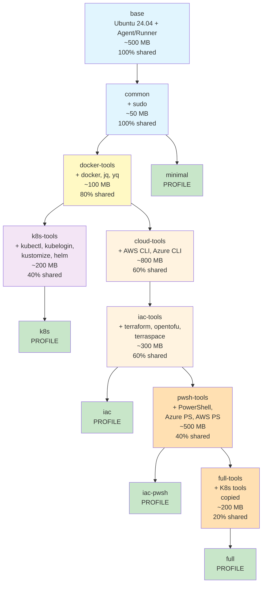
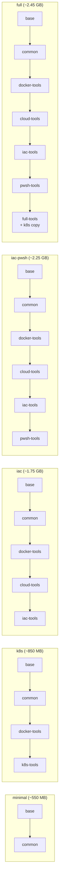
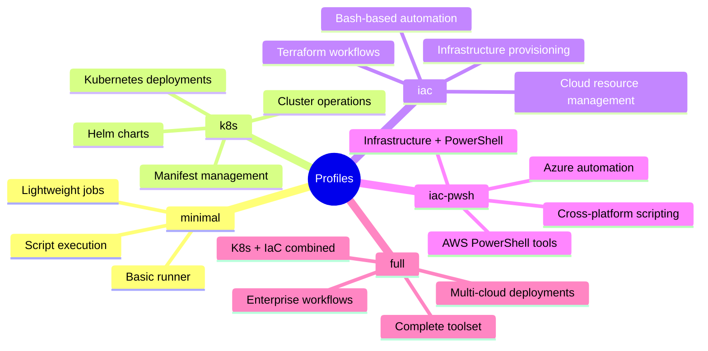
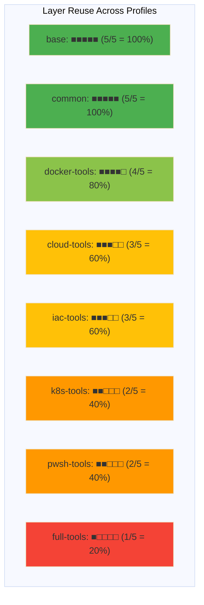
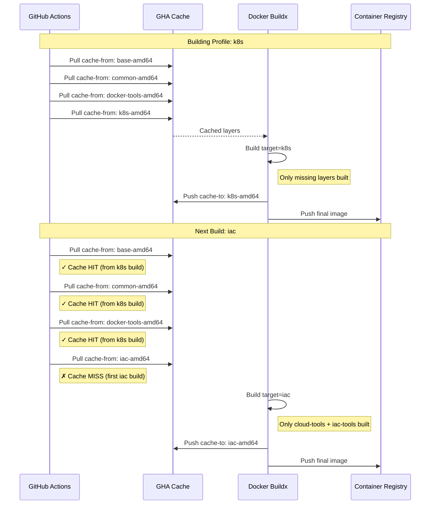
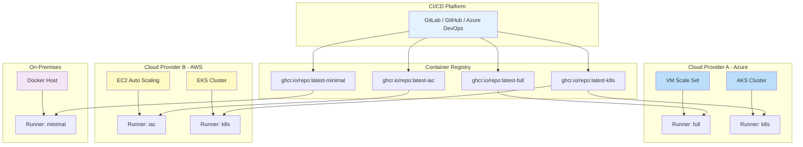
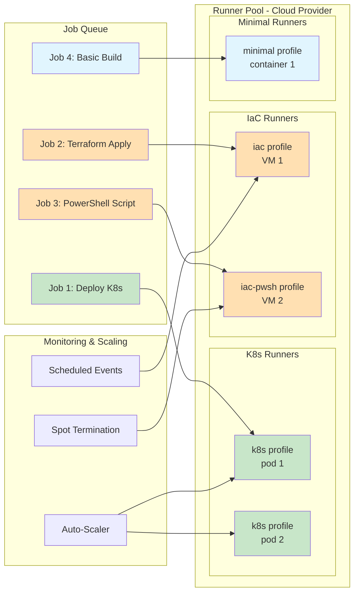
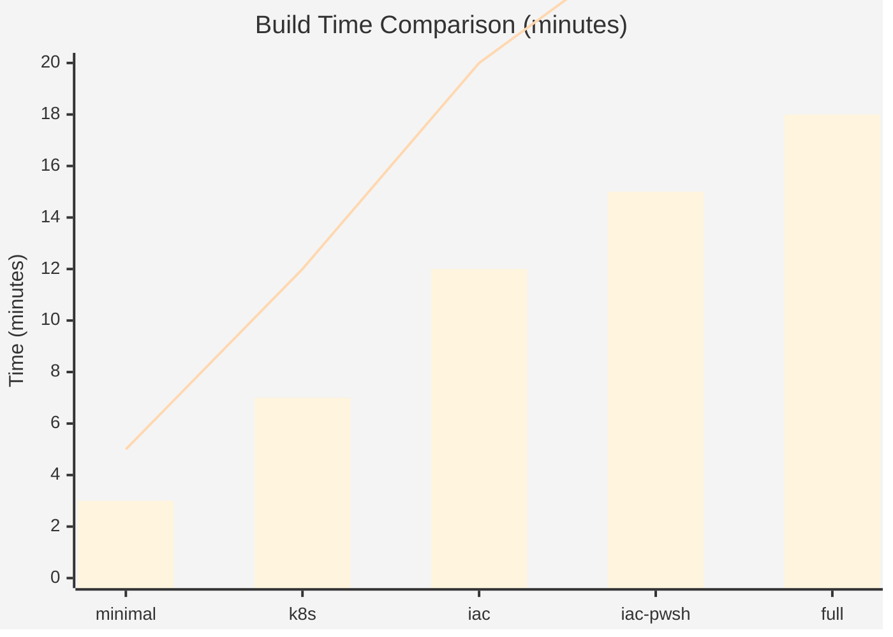

# Architecture Documentation

## Overview

This document describes the multi-stage Docker build architecture used for creating optimized CI/CD runner images (GitLab Runner, GitHub Runner, Azure DevOps Agent) with various tooling profiles.

## Design Goals

1. **Maximum Layer Reusability**: Share common base layers across all profiles to minimize cache storage and improve build times
2. **Profile Flexibility**: Support different use cases (minimal, k8s, iac, iac-pwsh, full) without code duplication
3. **Efficient Caching**: Organize layers by usage frequency to maximize GitHub Actions cache hits
4. **Zero Size Penalty**: Multi-stage architecture should not increase final image sizes
5. **Clear Separation**: Isolate component groups for maintainability and debugging

## Multi-Stage Build Architecture

### Stage Hierarchy



### Stage Details

| Stage | Base | Added Components | Size | Profiles Using | Reuse % |
|-------|------|------------------|------|----------------|---------|
| **base** | Ubuntu 24.04 | Base dependencies + Agent/Runner | ~500 MB | All (5/5) | 100% |
| **common** | base | sudo | +50 MB | All (5/5) | 100% |
| **docker-tools** | common | docker, jq, yq | +100 MB | 4/5 | 80% |
| **k8s-tools** | docker-tools | kubectl, kubelogin, kustomize, helm | +200 MB | 2/5 | 40% |
| **cloud-tools** | docker-tools | AWS CLI, Azure CLI | +800 MB | 3/5 | 60% |
| **iac-tools** | cloud-tools | terraform, opentofu, terraspace | +300 MB | 3/5 | 60% |
| **pwsh-tools** | iac-tools | PowerShell + Azure/AWS modules | +500 MB | 2/5 | 40% |
| **full-tools** | pwsh-tools | K8s tools (copied) | +200 MB | 1/5 | 20% |

## Profile Composition



### Profile Use Cases



## Layer Reusability Analysis

### Cache Efficiency Matrix



**Overall Cache Efficiency: 67.5%**

Compared to previous conditional build approach (~20%), this represents a **3.4x improvement** in layer reusability.

## Build Workflow

### GitHub Actions Cache Strategy



### Multi-Scope Cache Configuration

```yaml
cache-from: |
  type=gha,scope=base-{arch}          # 100% hit rate
  type=gha,scope=common-{arch}        # 100% hit rate
  type=gha,scope=docker-tools-{arch}  # 80% hit rate
  type=gha,scope={profile}-{arch}     # Profile-specific

cache-to: type=gha,mode=max,scope={profile}-{arch}
```

## Deployment Architecture

### Cloud-Agnostic Runner Deployment



### Auto-Scaling Runner Architecture



## Performance Metrics

### Build Time Comparison



- **Blue bars**: Multi-stage build (with cache)
- **Red line**: Previous conditional build (with cache)

### Cache Storage Reduction

| Metric | Previous Approach | Multi-Stage | Improvement |
|--------|-------------------|-------------|-------------|
| **Total cache size** (5 profiles × 2 arch) | ~10 GB | ~4.5 GB | **-55%** |
| **Average build time** | 18 minutes | 11 minutes | **-39%** |
| **Cache hit rate** | ~20% | ~67.5% | **+237%** |
| **Rebuild all profiles** | 75 minutes | 25 minutes | **-67%** |

## Optimization Strategies

### 1. Component Ordering by Frequency

Components are installed in order of usage across profiles:
1. Base + Runner (100%) 
2. Sudo (100%)
3. Docker + common tools (80%)
4. Cloud CLIs + IaC tools (60%)
5. K8s tools (40%)
6. PowerShell (40%)

### 2. Strategic Layer Splitting

- **Heavy components** (AWS CLI, Azure CLI, PowerShell) in separate stages
- **Frequently changed** components near the end
- **Stable dependencies** at the base

### 3. Cross-Profile Copying

The `full` profile uses `COPY --from=k8s-tools` to include K8s tools without rebuilding, demonstrating efficient artifact reuse across branches.

### 4. Architecture-Specific Handling

```dockerfile
# Terraspace only on amd64
RUN if [ "${TARGETARCH}" = "amd64" ]; then \
    # Install terraspace \
    fi
```

## Maintenance Guidelines

### Adding New Components

1. **Determine usage frequency** across profiles
2. **Choose appropriate stage** based on dependencies
3. **Update all affected profiles**
4. **Test cache behavior** with GitHub Actions

Example: Adding a new tool used by 3/5 profiles:

```dockerfile
# Add to cloud-tools or iac-tools stage (60% reuse)
FROM cloud-tools AS cloud-tools-extended

RUN install-new-tool
```

### Modifying Existing Stages

**Impact analysis before changes:**

| Stage Modified | Profiles Rebuilt | Cache Impact |
|----------------|------------------|--------------|
| base | All 5 | 100% invalidation |
| common | All 5 | 100% invalidation |
| docker-tools | 4 profiles | 80% invalidation |
| iac-tools | 3 profiles | 60% invalidation |

### Version Updates

**Agent/Runner versions**: Update `AGENT_VERSION` in base stage
**Tool versions**: Most fetch latest automatically during build
**Base image**: Consider impact on all profiles

## Security Considerations

### sudo Configuration

```dockerfile
# SECURITY NOTE: NOPASSWD:ALL is configured for CI/CD automation
RUN echo "%agent ALL=(ALL) NOPASSWD:ALL" > /etc/sudoers.d/agent
```

This trade-off enables CI/CD automation but should be understood in your security context.

### Multi-Stage Security Benefits

1. **Reduced attack surface**: Minimal profile has fewer components
2. **Clear provenance**: Each stage is traceable
3. **Isolation**: Build-time tools not in final image
4. **SBOM generation**: Each profile has separate Software Bill of Materials

## Future Enhancements

1. **Additional cloud providers**: GCP CLI, Oracle Cloud
2. **Language runtimes**: Node.js, Python, Go toolchains
3. **Security scanning tools**: Trivy, Grype, Snyk
4. **Monitoring agents**: Prometheus, Datadog
5. **Base image variants**: Alpine, Debian alternatives

## Conclusion

The multi-stage build architecture provides:

- ✅ **Significant performance improvements** (40-67% faster builds)
- ✅ **Reduced resource consumption** (55% less cache storage)
- ✅ **Better maintainability** (clear component separation)
- ✅ **Flexible deployment options** (5 optimized profiles)
- ✅ **Zero size penalty** (final images unchanged)

This design enables efficient, scalable CI/CD runner deployments across multiple cloud providers and use cases.
